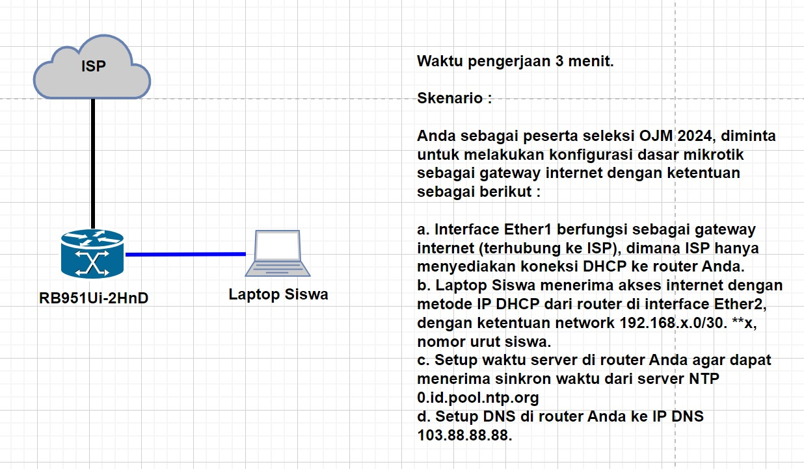

# Seleksi-OJM-tahap-5
Kamis 7 Agustus 2025

Seleksi internal tahap 5, seleksi internal terakhir sebelum pengumuman siapa yang lolos/bisa mengikuti OJM. Yang dipandu oleh Pak Rahmat dan Pak Abdu. Pada seleksi ini kita malakukan troubleshoot pada konfigurasi Mikrotik yang telah dibuat sebelumnya. Dengan ketentuan:

Penilaiannya :
100 = dibawah 3 menit
90  = 3-4 menit
80  = 4-5 menit
0	  = lebih dari 5 menit
